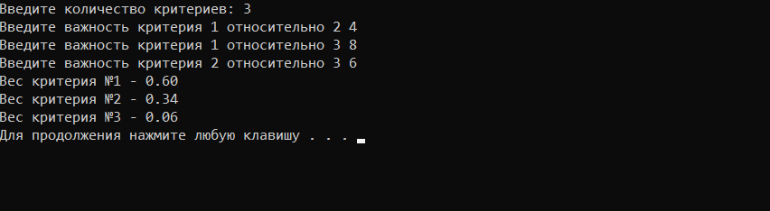

Описание программы
===================
Программа реализует метод анализа иерархий Томаса Саати для одного уровня. Входные данные - это количество критериев, которые сравниваются между собой, и данные попарного сравнения критериев. Значения  для сравнения должны быть  целыми числами от 1 до 9 включительно. На выходе пользователь получает весовые коэффиценты для  каждого критерия.

